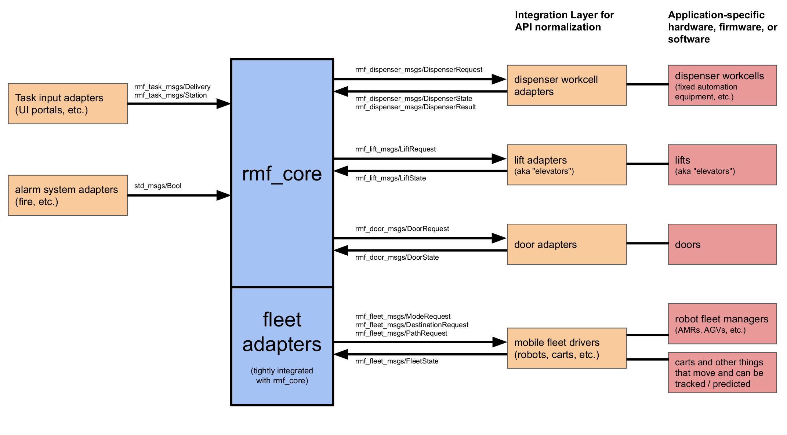

.. _documentation_home:

#####
|LPN|
#####

********
Overview
********

.. toctree::
   :hidden:

   getting_started/index.rst
   interfacing/index.rst
   modules.rst
   contributing/index.rst
   support/index.rst
   faq/index.rst
   about/index.rst

The core `rmf` packages provide the centralized functions of the Open Robotics Middleware Framework (OpenRMF).
These include task queuing, conflict-free resource scheduling, utilities to help create robot fleet adapters, and so on.

OpenRMF is built on ROS 2.
However direct use of ROS 2 is not required to use Open-RMF.

To create a useful deployment, the core of `rmf` must be connected to many other subsystems, as shown in the following diagram.

Roadmap
=======

A near-term roadmap of the entire RMF project (including and beyond `rmf_core`) can be found in the user manual `here <https://osrf.github.io/ros2multirobotbook/roadmap.html>`_.
